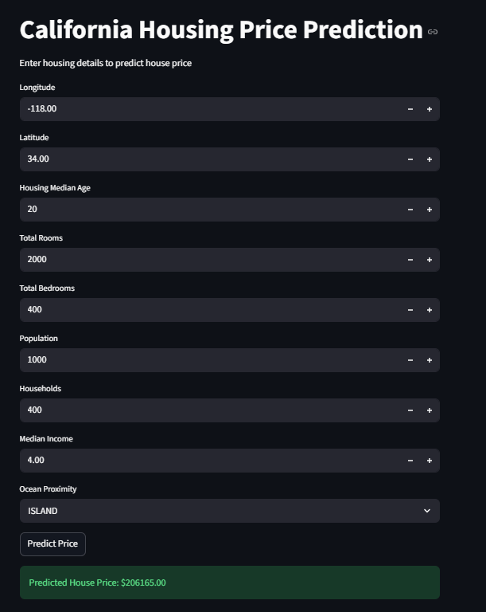
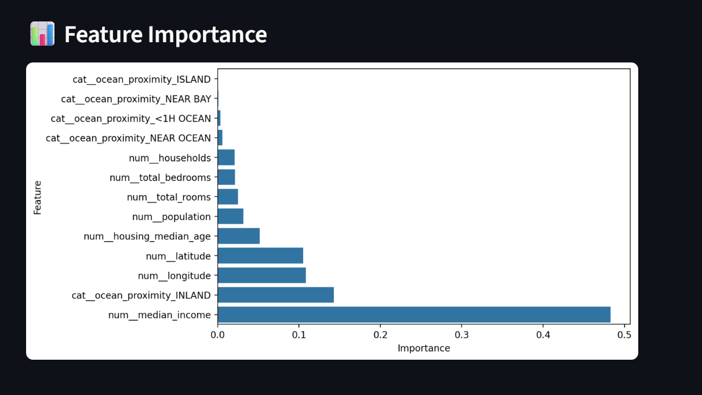

# 🏠 California Housing Price Prediction

An **end-to-end Machine Learning project** that predicts **California housing prices** using multiple regression models and a deployed **Streamlit web application**.

The project demonstrates a complete ML workflow:

* Exploratory Data Analysis (EDA)
* Data preprocessing
* Model training
* Model evaluation
* Model persistence
* Web application deployment

---

# 🌐 Live Demo

👉 Try the app here:
🔗 https://house-price-saiabhishek.streamlit.app/

---

# 📌 Project Overview

Housing prices depend on factors such as:

* Location
* Income levels
* Population density
* Housing age
* Proximity to the ocean

This project builds a **machine learning model using Random Forest Regression** to predict housing prices based on these features.

The trained model is then deployed using **Streamlit** to create an interactive web application.

---

# 🏗️ Machine Learning Pipeline

```
Dataset → Data Cleaning → EDA → Feature Engineering → 
Model Training → Evaluation → Saved Model → Streamlit Web App
```

---

# 📊 Dataset

Dataset: **California Housing Dataset**

### Features:

| Feature            | Description              |
| ------------------ | ------------------------ |
| longitude          | Geographic longitude     |
| latitude           | Geographic latitude      |
| housing_median_age | Median age of houses     |
| total_rooms        | Total number of rooms    |
| total_bedrooms     | Total number of bedrooms |
| population         | Population of district   |
| households         | Number of households     |
| median_income      | Median income            |
| ocean_proximity    | Distance from ocean      |

### 🎯 Target:

`median_house_value`

---

# 🤖 Machine Learning Model

Model used:

**RandomForestRegressor**

### Evaluation Metrics:

* Root Mean Squared Error (RMSE)
* Mean Absolute Error (MAE)
* R² Score

### 📈 Performance:

* Cross Validation RMSE: **49,432**
* Model RMSE: **18,342**
* MAE: **11,813**
* R² Score: **0.97**

---

# 💻 Streamlit Web Application

A Streamlit web app was built to allow users to **input housing features and get price predictions in real time**.

### Users can enter:

* Longitude
* Latitude
* Housing median age
* Total rooms
* Total bedrooms
* Population
* Households
* Median income
* Ocean proximity

---

# 📷 Application Output

### 🔹 Input & Pre
--- []
---[]

### 🔹 Feature Importance

---

### 📌 Example Prediction

**Predicted House Price: $206,165.00**

---

# 📂 Project Structure

```
california-housing-price-prediction/

├── app.py
├── model.pkl
├── pipeline.pkl
├── requirements.txt
├── runtime.txt
├── README.md

├── data/
│   ├── housing.csv
│   ├── test_set.csv

├── notebooks/
│   ├── EDA_of_houseprice_dataset.ipynb
│   ├── ML_housing.ipynb

├── scripts/
│   ├── automated_eda.py
│   ├── choosing_best_model.py
│   ├── final_persistant_model.py

├── outputs/
│   ├── app_output_1.png
│   ├── app_output_2.png
│   ├── housing_data_report.html
│   ├── predictions_of_test.csv
```

---

# 🚀 Running the Web App

### Install dependencies

```
pip install -r requirements.txt
```

### Run the app

```
streamlit run app.py
```

---

# 🧠 Skills Demonstrated

* Exploratory Data Analysis
* Feature Engineering
* Machine Learning
* Model Evaluation
* Model Deployment
* Streamlit Web Apps
* End-to-End Data Science Workflow

---

# 🔮 Future Improvements

* Add model explainability (SHAP)
* Add map visualization (lat/long)
* Improve UI design
* Add advanced visualizations

---

# ⭐ Support

If you found this project useful:

👉 Give it a ⭐ on GitHub

---

# 👨‍💻 Author

**Sai Abhishek Bonagiri**
