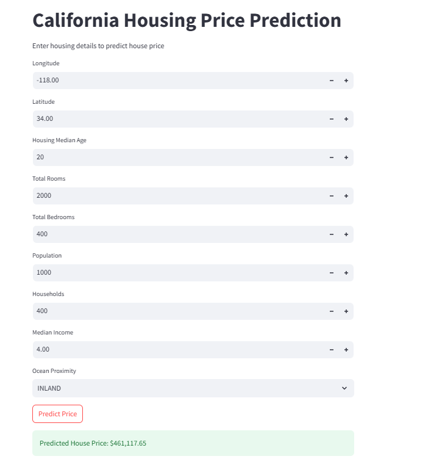

# 🏠 California Housing Price Prediction

An **end‑to‑end Machine Learning project** that predicts **California
housing prices** using multiple regression models and a deployed
**Streamlit web application**.

The project demonstrates a complete ML workflow:

-   Exploratory Data Analysis (EDA)
-   Data preprocessing
-   Model training
-   Model evaluation
-   Model persistence
-   Web application deployment

------------------------------------------------------------------------

# 📌 Project Overview

Housing prices depend on factors such as:

-   Location
-   Income levels
-   Population density
-   Housing age
-   Proximity to the ocean

This project builds a **machine learning model using Random Forest
Regression** to predict housing prices based on these features.

The trained model is then deployed using **Streamlit** to create an
interactive web application.

------------------------------------------------------------------------

# 🏗️ Machine Learning Pipeline

Dataset → Data Cleaning → EDA → Feature Engineering → Model Training →
Evaluation → Saved Model → Streamlit Web App

------------------------------------------------------------------------

# 📊 Dataset

Dataset: **California Housing Dataset**

Features:

  Feature              Description
  -------------------- --------------------------
  longitude            Geographic longitude
  latitude             Geographic latitude
  housing_median_age   Median age of houses
  total_rooms          Total number of rooms
  total_bedrooms       Total number of bedrooms
  population           Population of district
  households           Number of households
  median_income        Median income
  ocean_proximity      Distance from ocean

Target:

median_house_value

------------------------------------------------------------------------

# 🤖 Machine Learning Model

Model used:

**RandomForestRegressor**

Evaluation metric:

**Root Mean Squared Error (RMSE)**

### Cross Validation Results

Mean RMSE: **49,432**

Final Test RMSE:

**18,342**

------------------------------------------------------------------------

# 💻 Streamlit Web Application

A Streamlit web app was built to allow users to **input housing features
and get price predictions in real time**.

Users can enter:

-   Longitude
-   Latitude
-   Housing median age
-   Total rooms
-   Total bedrooms
-   Population
-   Households
-   Median income
-   Ocean proximity

The app then uses the trained model to generate predictions.

------------------------------------------------------------------------

# 📷 Application Output

Example prediction from the web app:

Predicted House Price:

**\$461,117.65**

The application interface includes:

-   Interactive numeric inputs
-   Dropdown for ocean proximity
-   Predict button
-   Real‑time price prediction output
-   
------------------------------------------------------------------------

# 📂 Project Structure

California-Housing-Prediction

data/ housing.csv

notebooks/ eda_and_model_training.ipynb

models/ model.pkl

app.py

predictions_of_test.csv

requirements.txt

README.md

------------------------------------------------------------------------

# 🚀 Running the Web App

### Install dependencies

pip install -r requirements.txt

### Run the Streamlit app

streamlit run app.py

------------------------------------------------------------------------

# 🧠 Skills Demonstrated

-   Exploratory Data Analysis
-   Feature Engineering
-   Machine Learning
-   Model Evaluation
-   Model Deployment
-   Streamlit Web Apps
-   Data Science Workflow

------------------------------------------------------------------------

# 🔮 Future Improvements

-   Add model explainability (SHAP)
-   Deploy web app online using Streamlit Cloud
-   Improve UI design
-   Add feature importance visualization

------------------------------------------------------------------------

⭐ If you found this project useful, consider giving it a **star on
GitHub**.
